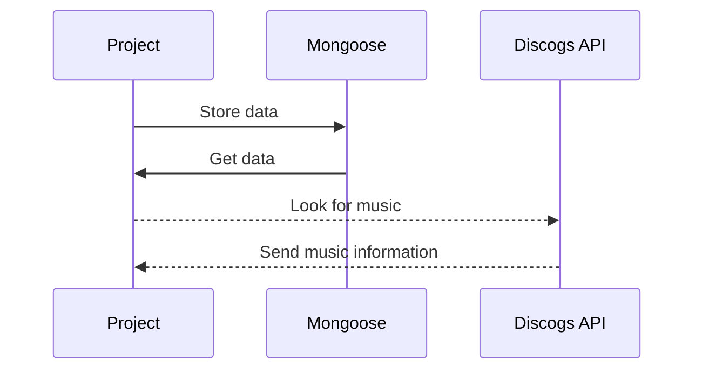

# Aux App

Get music from API and add to your playlist, then filter your playlist based on your mood with a slider

## ScreenShots

Screenshots

## Restful Routes

| RESTful Routes | HTML     | Verb   |
| -------------- | -------- | ------ |
| Index          | /        | GET    |
| New            | //:query | GET    |
| Delete         | //\_:id  | DELETE |
| Create         | /        | POST   |
| Show           | //:\_id  | GET    |

## Getting Started

Link: https://aux-app.herokuapp.com/song

## Next Steps

Look for a new API that gives the ability to play songs rather than just showing them.

## Technology Used

