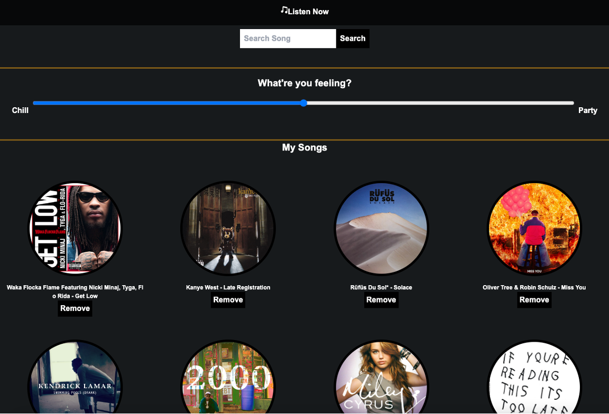
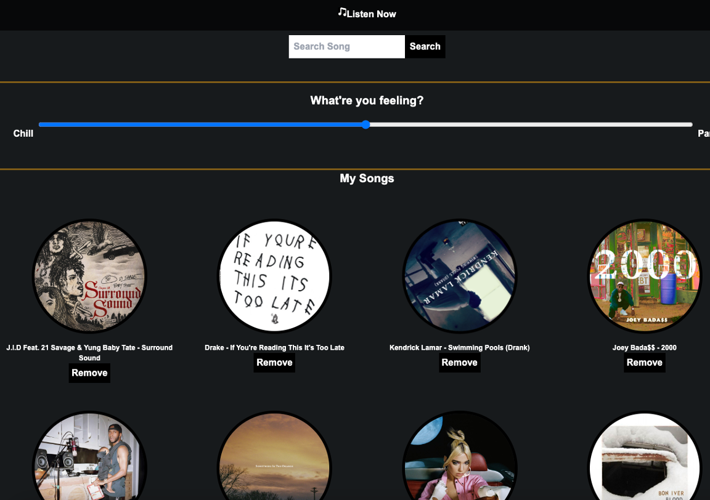
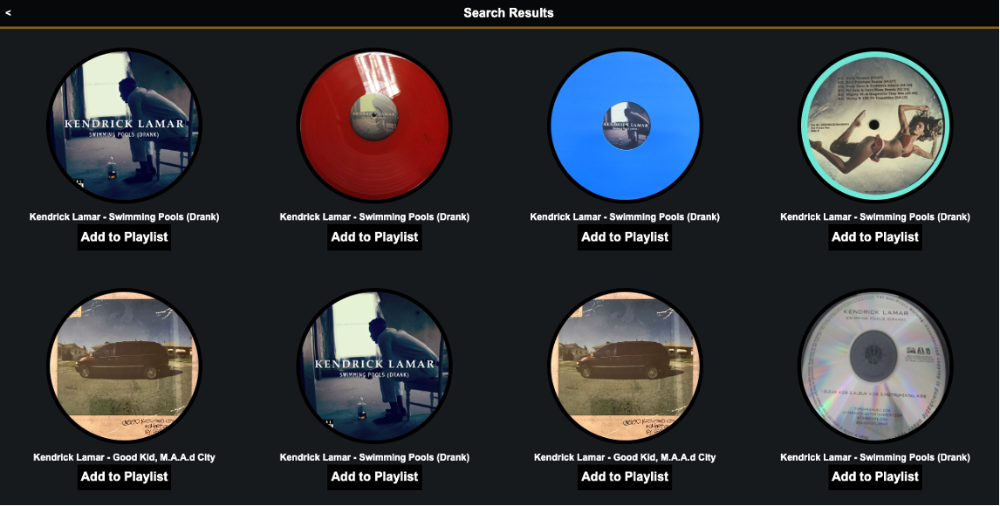
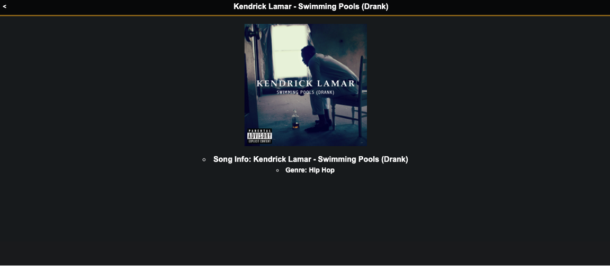
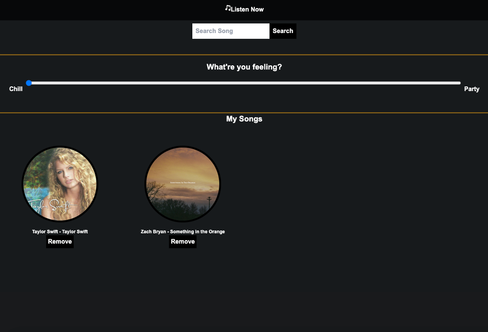
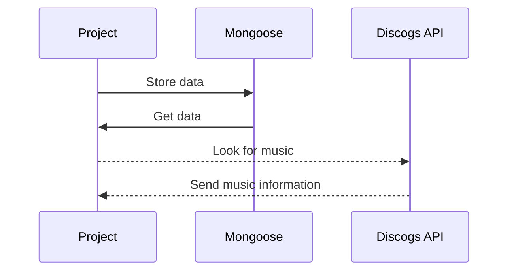

# Aux App

Get music from API and add to your playlist, then filter your playlist based on your mood with a slider

## Getting Started

Link: https://aux-app.herokuapp.com/song

## ScreenShots

The home screen shows all of your songs added to the playlist

Clicking on a song will spin the record and "play" the song

Using the seach bar you can look for all music in the Dicogs API database

You can then add these songs to your playlist
Once a song is on your playlist you can remove or click the song title for more details

Depending on your mood you can filter using the slider

## Restful Routes

| RESTful Routes | HTML     | Verb   |
| -------------- | -------- | ------ |
| Index          | /        | GET    |
| New            | //:query | GET    |
| Delete         | //\_:id  | DELETE |
| Create         | /        | POST   |
| Show           | //:\_id  | GET    |

## Next Steps

Keep same functionality, but look for a new API with the ability to play music

## Technology Used
<li>
MongoDB
express
JSX
JavaScript
TailWind
express-session
jsx-view-engine
Discogs API
</li>

