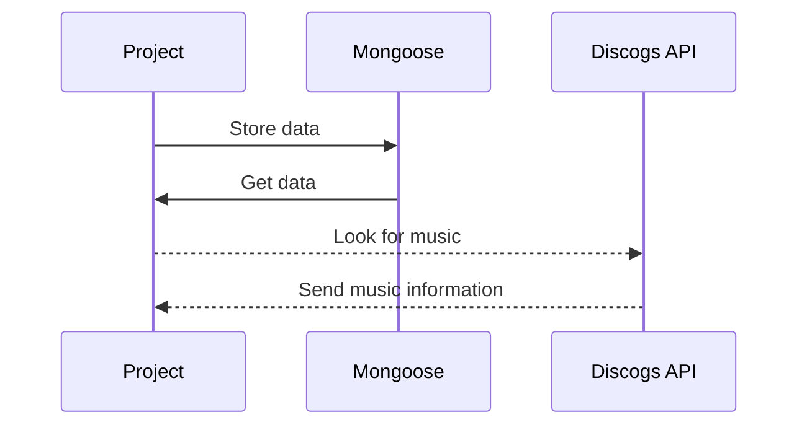

# Project 2

Get music from API and add to your playlist, then filter your playlist based on your mood with a slider

## ScreenShots

Screenshots

## Restful Routes

| RESTful Routes | HTML       | Verb   |
| -------------- | ---------- | ------ |
| Index          | /          | GET    |
| New            | //new      | GET    |
| Delete         | //:id      | DELETE |
| Update         | //:id      | PUT    |
| Create         | /          | POST   |
| Edit           | //:id/edit | GET    |
| Show           | //:id      | GET    |

## Getting Started

Show and link
Heroku Link

## Next Steps

Look for a new API that gives the ability to play songs rather than just showing them.

## Technology Used

